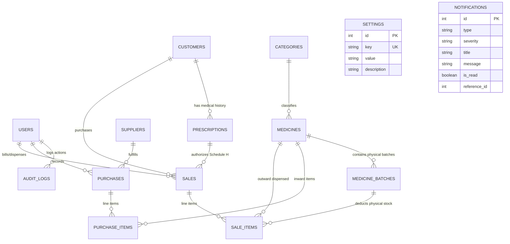

# PharmaCare Database Schema & Data Dictionary

This document details the relational database architecture, entity relationships, integrity constraints, and indexing strategy for **PharmaCare – Smart Pharmacy Management & Inventory Monitoring**.

---

## 1. Entity-Relationship Diagram (ERD)

---

## 2. Table Specifications & Data Dictionary

### 2.1 `users`
Stores authenticated staff members with Role-Based Access Control (RBAC).

| Column | Type | Constraints | Description |
|---|---|---|---|
| `id` | `INTEGER` | `PRIMARY KEY`, `AUTOINCREMENT` | Unique user identifier |
| `username` | `VARCHAR(50)` | `UNIQUE`, `NOT NULL`, `INDEX` | Unique login username |
| `email` | `VARCHAR(120)` | `UNIQUE`, `NOT NULL`, `INDEX` | Unique registered email |
| `password_hash` | `VARCHAR(255)` | `NOT NULL` | Direct `bcrypt` cryptographic hash |
| `full_name` | `VARCHAR(100)` | `NOT NULL` | Formal staff member name |
| `role` | `VARCHAR(20)` | `NOT NULL`, `DEFAULT 'pharmacist'` | Access tier: `'admin'` or `'pharmacist'` |
| `phone` | `VARCHAR(20)` | `NULLABLE` | Contact phone number |
| `is_active` | `BOOLEAN` | `NOT NULL`, `DEFAULT TRUE` | Active account status flag |
| `created_at` | `DATETIME` | `NOT NULL` | Timestamp of registration |
| `updated_at` | `DATETIME` | `NOT NULL` | Timestamp of last modification |

---

### 2.2 `categories`
Therapeutic and pharmacological medicine classifications.

| Column | Type | Constraints | Description |
|---|---|---|---|
| `id` | `INTEGER` | `PRIMARY KEY`, `AUTOINCREMENT` | Unique category identifier |
| `name` | `VARCHAR(80)` | `UNIQUE`, `NOT NULL`, `INDEX` | Category name (e.g. *Antibiotics*) |
| `description` | `TEXT` | `NULLABLE` | Pharmacological scope description |
| `created_at` | `DATETIME` | `NOT NULL` | Timestamp created |
| `updated_at` | `DATETIME` | `NOT NULL` | Timestamp updated |

---

### 2.3 `medicines`
Master pharmaceutical catalog items.

| Column | Type | Constraints | Description |
|---|---|---|---|
| `id` | `INTEGER` | `PRIMARY KEY`, `AUTOINCREMENT` | Unique medicine master identifier |
| `name` | `VARCHAR(120)` | `NOT NULL`, `INDEX` | Commercial brand name (e.g. *Paracetamol*) |
| `generic_name` | `VARCHAR(120)` | `NOT NULL`, `INDEX` | Active pharmaceutical ingredient (API) |
| `brand` | `VARCHAR(100)` | `NULLABLE` | Marketing brand name |
| `category_id` | `INTEGER` | `NOT NULL`, `FK(categories.id, RESTRICT)` | Parent therapeutic category |
| `manufacturer` | `VARCHAR(120)` | `NULLABLE` | Pharmaceutical manufacturer company |
| `barcode` | `VARCHAR(64)` | `UNIQUE`, `NULLABLE`, `INDEX` | EAN/UPC commercial barcode string |
| `dosage_form` | `VARCHAR(50)` | `NOT NULL`, `DEFAULT 'Tablet'` | Form (*Tablet, Capsule, Syrup, Injection*) |
| `strength` | `VARCHAR(50)` | `NOT NULL` | Active dosage (e.g. *500mg, 10ml, 250mg*) |
| `selling_price` | `FLOAT` | `NOT NULL`, `DEFAULT 0.0` | Retail Maximum Retail Price (MRP) |
| `min_stock` | `INTEGER` | `NOT NULL`, `DEFAULT 15` | Minimum threshold trigger for low-stock |
| `prescription_required`| `BOOLEAN` | `NOT NULL`, `DEFAULT FALSE` | Statutory Schedule H / Rx requirement flag |
| `status` | `VARCHAR(20)` | `NOT NULL`, `DEFAULT 'active'` | Catalog state: `'active'` or `'inactive'` |

---

### 2.4 `medicine_batches`
Physical inventory tracked at the individual batch and expiry date level.

| Column | Type | Constraints | Description |
|---|---|---|---|
| `id` | `INTEGER` | `PRIMARY KEY`, `AUTOINCREMENT` | Unique batch lot identifier |
| `medicine_id` | `INTEGER` | `NOT NULL`, `FK(medicines.id, CASCADE)` | Associated medicine master entity |
| `batch_no` | `VARCHAR(50)` | `NOT NULL`, `INDEX` | Physical lot number on package |
| `expiry_date` | `DATE` | `NOT NULL`, `INDEX` | Statutory expiration date |
| `quantity` | `INTEGER` | `NOT NULL`, `DEFAULT 0` | Available physical quantity in inventory |
| `purchase_price` | `FLOAT` | `NOT NULL`, `DEFAULT 0.0` | Historical unit procurement cost |
| **Unique Constraint** | `(medicine_id, batch_no)` | `UNIQUE` | Prevents duplicate batch numbers per medicine |
| **Composite Index** | `(medicine_id, expiry_date)` | `INDEX` | Accelerates FEFO sorting queries |

---

### 2.5 `suppliers`
Wholesale drug distributors and procurement vendors.

| Column | Type | Constraints | Description |
|---|---|---|---|
| `id` | `INTEGER` | `PRIMARY KEY`, `AUTOINCREMENT` | Unique supplier identifier |
| `name` | `VARCHAR(120)` | `NOT NULL`, `INDEX` | Distributor business name |
| `contact_person` | `VARCHAR(100)` | `NULLABLE` | Primary account representative |
| `phone` | `VARCHAR(20)` | `NOT NULL`, `INDEX` | Contact telephone number |
| `email` | `VARCHAR(120)` | `NULLABLE` | Official business email |
| `address` | `TEXT` | `NULLABLE` | Warehouse/office physical address |
| `gst_number` | `VARCHAR(30)` | `NULLABLE` | Statutory GSTIN / Tax identifier |
| `payment_terms` | `VARCHAR(50)` | `NOT NULL`, `DEFAULT 'Net 30'` | Credit terms (*Net 30, COD, Pre-paid*) |

---

### 2.6 `purchases` & `purchase_items`
Inward procurement invoices from licensed suppliers.

| Table | Column | Type | Constraints | Description |
|---|---|---|---|---|
| `purchases` | `id` | `INTEGER` | `PK` | Procurement order ID |
| `purchases` | `invoice_no` | `VARCHAR(60)` | `UNIQUE`, `NOT NULL` | Supplier's invoice number |
| `purchases` | `supplier_id` | `INTEGER` | `FK(suppliers.id, RESTRICT)` | Fulfilling supplier |
| `purchases` | `user_id` | `INTEGER` | `FK(users.id, RESTRICT)` | Receiving staff member |
| `purchases` | `purchase_date` | `DATE` | `NOT NULL`, `INDEX` | Date of invoice/intake |
| `purchases` | `total_amount` | `FLOAT` | `NOT NULL` | Total invoice payable |
| `purchases` | `status` | `VARCHAR(30)` | `DEFAULT 'received'` | Status (*received, cancelled*) |
| `purchase_items` | `id` | `INTEGER` | `PK` | Purchase line item ID |
| `purchase_items` | `purchase_id` | `INTEGER` | `FK(purchases.id, CASCADE)` | Parent purchase order |
| `purchase_items` | `medicine_id` | `INTEGER` | `FK(medicines.id, RESTRICT)` | Procured medicine |
| `purchase_items` | `batch_no` | `VARCHAR(50)` | `NOT NULL` | Inward batch number |
| `purchase_items` | `expiry_date` | `DATE` | `NOT NULL` | Batch expiry date |
| `purchase_items` | `quantity` | `INTEGER` | `NOT NULL` | Units received |
| `purchase_items` | `purchase_price` | `FLOAT` | `NOT NULL` | Unit procurement cost |
| `purchase_items` | `subtotal` | `FLOAT` | `NOT NULL` | Line total (`quantity * price`) |

---

### 2.7 `customers`
Registered patients and retail buyers.

| Column | Type | Constraints | Description |
|---|---|---|---|
| `id` | `INTEGER` | `PRIMARY KEY`, `AUTOINCREMENT` | Unique customer identifier |
| `name` | `VARCHAR(100)` | `NOT NULL`, `INDEX` | Patient or customer full name |
| `phone` | `VARCHAR(20)` | `UNIQUE`, `NOT NULL`, `INDEX` | Unique contact phone number |
| `email` | `VARCHAR(120)` | `NULLABLE` | Email for digital invoice dispatch |
| `address` | `TEXT` | `NULLABLE` | Residential address |

---

### 2.8 `prescriptions`
Prescription records required for Schedule H/X compliance.

| Column | Type | Constraints | Description |
|---|---|---|---|
| `id` | `INTEGER` | `PRIMARY KEY`, `AUTOINCREMENT` | Prescription record ID |
| `customer_id` | `INTEGER` | `FK(customers.id, SET NULL)`, `NULLABLE` | Linked patient profile |
| `doctor_name` | `VARCHAR(100)` | `NOT NULL` | Prescribing medical doctor |
| `doctor_reg_no` | `VARCHAR(50)` | `NULLABLE` | Medical Council Registration No. |
| `patient_name` | `VARCHAR(100)` | `NOT NULL` | Patient name on prescription |
| `patient_age` | `INTEGER` | `NULLABLE` | Patient age in years |
| `patient_gender` | `VARCHAR(10)` | `NULLABLE` | Patient gender |
| `prescription_date`| `DATE` | `NOT NULL`, `DEFAULT today` | Date prescribed |
| `diagnosis` | `TEXT` | `NULLABLE` | Clinical diagnosis or condition |
| `file_path` | `VARCHAR(255)` | `NULLABLE` | Stored scan or prescription image |

---

### 2.9 `sales` & `sale_items`
Outward point-of-sale retail dispensing invoices.

| Table | Column | Type | Constraints | Description |
|---|---|---|---|---|
| `sales` | `id` | `INTEGER` | `PK` | Sales transaction ID |
| `sales` | `invoice_no` | `VARCHAR(60)` | `UNIQUE`, `NOT NULL`, `INDEX` | System formatted invoice (`INV-2026-XXXX`) |
| `sales` | `customer_id` | `INTEGER` | `FK(customers.id, SET NULL)` | Billed customer (or null for walk-in) |
| `sales` | `prescription_id`| `INTEGER` | `FK(prescriptions.id, SET NULL)` | Required if Schedule H medicines present |
| `sales` | `user_id` | `INTEGER` | `FK(users.id, RESTRICT)` | Cashier / Pharmacist ID |
| `sales` | `payment_method`| `VARCHAR(30)` | `DEFAULT 'Cash'` | Method (*Cash, UPI, Card, Other*) |
| `sales` | `subtotal` | `FLOAT` | `NOT NULL` | Line items subtotal |
| `sales` | `discount` | `FLOAT` | `NOT NULL`, `DEFAULT 0.0` | Invoice discount amount |
| `sales` | `tax` | `FLOAT` | `NOT NULL`, `DEFAULT 0.0` | GST tax component |
| `sales` | `total_amount` | `FLOAT` | `NOT NULL` | Final invoice total |
| `sales` | `sale_date` | `DATETIME` | `NOT NULL`, `INDEX` | Checkout timestamp |
| `sale_items` | `id` | `INTEGER` | `PK` | Dispensed line item ID |
| `sale_items` | `sale_id` | `INTEGER` | `FK(sales.id, CASCADE)` | Parent sales invoice |
| `sale_items` | `medicine_id` | `INTEGER` | `FK(medicines.id, RESTRICT)` | Dispensed medicine master |
| `sale_items` | `batch_id` | `INTEGER` | `FK(medicine_batches.id, RESTRICT)` | Exact batch deducted via FEFO |
| `sale_items` | `quantity` | `INTEGER` | `NOT NULL` | Units dispensed |
| `sale_items` | `unit_price` | `FLOAT` | `NOT NULL` | Selling price per unit at sale time |
| `sale_items` | `purchase_price`| `FLOAT` | `NOT NULL` | Historical purchase cost for profit computation |
| `sale_items` | `subtotal` | `FLOAT` | `NOT NULL` | Line total (`quantity * unit_price`) |

---

### 2.10 `notifications`
Automated inventory and system event alerts.

| Column | Type | Constraints | Description |
|---|---|---|---|
| `id` | `INTEGER` | `PRIMARY KEY`, `AUTOINCREMENT` | Alert notification ID |
| `type` | `VARCHAR(50)` | `NOT NULL` | Type (`expiry`, `low_stock`, `system`) |
| `severity` | `VARCHAR(20)` | `NOT NULL` | Severity (`info`, `warning`, `critical`) |
| `title` | `VARCHAR(150)` | `NOT NULL` | Alert title |
| `message` | `TEXT` | `NOT NULL` | Detailed alert message |
| `is_read` | `BOOLEAN` | `NOT NULL`, `DEFAULT FALSE`, `INDEX` | Read / unread status flag |
| `reference_id` | `INTEGER` | `NULLABLE` | Associated medicine_id or batch_id |

---

### 2.11 `audit_logs`
Immutable compliance event log.

| Column | Type | Constraints | Description |
|---|---|---|---|
| `id` | `INTEGER` | `PRIMARY KEY`, `AUTOINCREMENT` | Audit log sequence ID |
| `user_id` | `INTEGER` | `NULLABLE`, `FK(users.id, SET NULL)` | User who executed action |
| `username` | `VARCHAR(50)` | `NOT NULL`, `INDEX` | Snapshot username |
| `action` | `VARCHAR(50)` | `NOT NULL`, `INDEX` | Operation (`LOGIN`, `CREATE`, `UPDATE`, `DELETE`, `DISPOSE`, `BACKUP`, `RESTORE`) |
| `module` | `VARCHAR(50)` | `NOT NULL`, `INDEX` | System subsystem (`AUTH`, `BILLING`, `INVENTORY`, `USERS`, `DATABASE`) |
| `description` | `TEXT` | `NOT NULL` | Human-readable audit narrative |
| `ip_address` | `VARCHAR(45)` | `NULLABLE` | Client IP address |
| `timestamp` | `DATETIME` | `NOT NULL`, `INDEX` | Timestamp of event |

---

### 2.12 `settings`
Key-value runtime configuration and hospital metadata.

| Column | Type | Constraints | Description |
|---|---|---|---|
| `id` | `INTEGER` | `PRIMARY KEY`, `AUTOINCREMENT` | Setting ID |
| `key` | `VARCHAR(60)` | `UNIQUE`, `NOT NULL`, `INDEX` | Configuration key name |
| `value` | `TEXT` | `NOT NULL` | Serialized setting value |
| `description` | `VARCHAR(200)` | `NULLABLE` | Human-readable parameter description |
